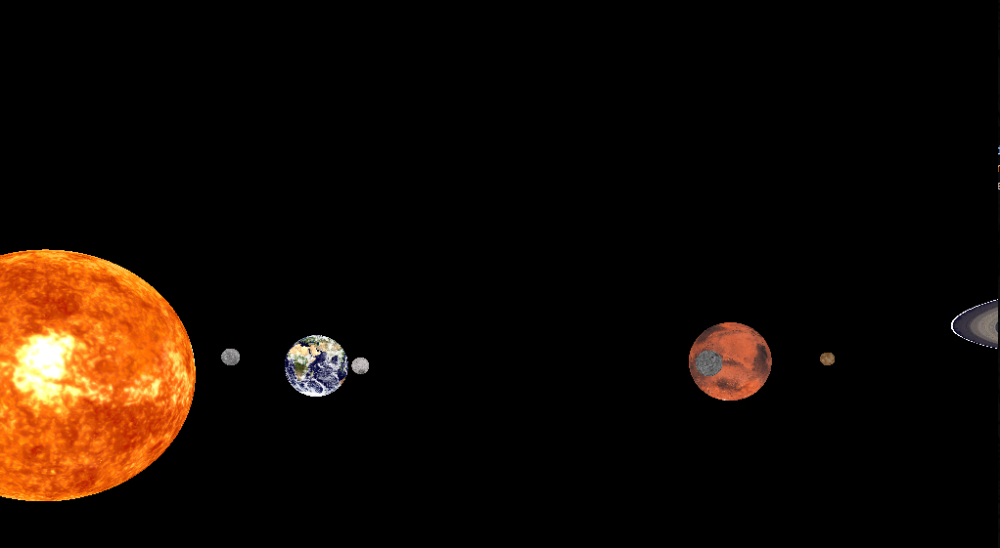
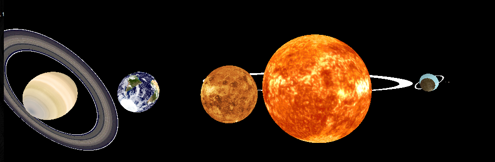
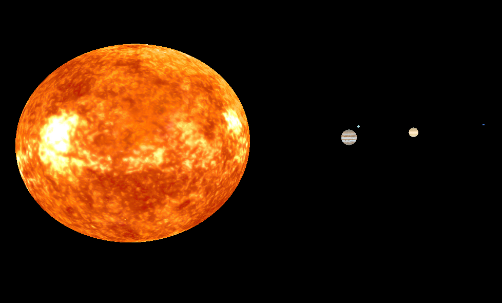

# PA7: Solar System
## Images:
#Sun Scaled down so other celestial bodies are visible:


#Realistically Scaled:



## Team:
- [Benjamin Estela](https://github.com/nebunr)
- [Sidney Inouye](https://github.com/sinouye)
- [Jonathon Hewitt](https://github.com/zotlann)

## Project Description
Welcome to our Solar System. Using Assimp and ImageMagick, we have been able to create a solar system reminiscent of the one we are living in with the Sun in the center and us, on planet Earth.

## Dependency Instructions
To run this project on Linux, installation of these three programs are required [GLEW](http://glew.sourceforge.net/), [GLM](http://glm.g-truc.net/0.9.7/index.html), and [SDL2](https://wiki.libsdl.org/Tutorials).

This project uses OpenGL 3.3. Some computers, such as virtual machines in the ECC, can not run this version. In in order to run OpenGL 2.7 follow the instructions at [Using OpenGL 2.7](https://github.com/HPC-Vis/computer-graphics/wiki/Using-OpenGL-2.7)

### Ubuntu/Linux
Assimp and Magick++ are needed.
```bash
sudo apt-get install libglew-dev libglm-dev libsdl2-dev libassimp-dev
```

## Build Instructions
NOTE: Building with cmake will cause the executable to be called ./Tutorial.  Cmake is not officially supported, but it will build. Change the commands as necessary if built using cmake.

Use make with the following commands:
```bash
mkdir build
cp makefile build
cd build
make
```

## Usage Instructions
```bash
./PA7 -c [master_config_file]
```
**EXAMPLE:**
```bash
./PA7 -c ../assets/configs/[folder]/master.xml
```
**Accurate with a small Sun: (recommended for graded)**
```bash
./PA7 -c ../assets/configs/accurate_smallSun/master.xml
```
**Scaled: (can see smaller objects like Pluto easier)**
```bash
./PA7 -c ../assets/configs/scaled/master.xml
```
NOTE: After starting, would recommend resetting the view with middle mouse as mouse movement to set the window into focus can throw off the camera.

## Mouse
| Input | Output |
| - |:-:|
| Left Mouse | Move up |
| Right Mouse | Move down |
| Middle Mouse | Reset camera |
| Move Mouse | Look around |

## Keyboard
| Input | Output |
| - |:-:|
| <kbd>&#8592;</kbd> | Move left |
| <kbd>&#8593;</kbd> | Move forward |
| <kbd>&#8594;</kbd> | Move right |
| <kbd>&#8595;</kbd> | Move back |
| <kbd>Tab</kbd> | Cycle through planets (terminal prints selected planet) |
| <kbd>Q</kbd> | Lower simulation speed of all planets |
| <kbd>W</kbd> | Raise simulation speed of all planets |
| <kbd>R</kbd> | Pause/unpause selected object’s rotation |
| <kbd>A</kbd> | Flip selected object’s orbit direction |
| <kbd>S</kbd> | Lower selected object’s orbit speed |
| <kbd>D</kbd> | Raise selected object’s orbit speed |
| <kbd>F</kbd> | When selected Earth, learn about the *truth* (read extra credit below) |
| <kbd>Z</kbd> | Lower selected object’s orbit distance |
| <kbd>X</kbd> | Raise selected object’s orbit distance |
| <kbd>C</kbd> | Lower selected object’s scale |
| <kbd>V</kbd> | Raise selected object’s scale |
| <kbd>B</kbd> | Pause/unpause selected object’s orbit |


## Extra Credit
* Live adjustment of simulation speed occurs with <kbd>Q</kbd> and <kbd>E</kbd>  
* Configuration files exists through TinyXML2 such that you do not have to recompile for config changes  
* Option to go from actual data to scaled view does happen when changing master.xml configs  
* Proper rings appear on Saturn, Neptune, Jupiter, and Uranus  
* All planets are titled to their proper axis (ex. Earth being tilted 23.5°)
* Planets also orbit in their proper axis too  
* You can individual select each planet, satellite, as well as the Sun by pressing Tab and adjust some of attributes like speed (read above controls)  
* Is the Earth really round? Press <kbd>F</kbd> when Earth is selected through <kbd>Tab</kbd> (read terminal to check that) to toggle the flat earth and read a message from: wiki.tfes.org  
NOTE: This piece of extra credit is intended as a joke.  
